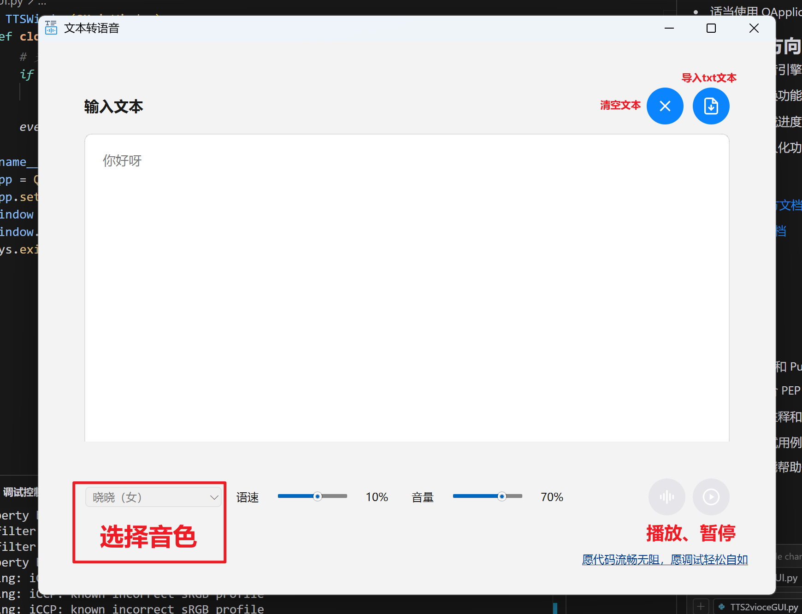

# 文本转语音(TTS)桌面应用程序开发教程

## 项目介绍

这是一个基于 PySide6 和 Edge TTS 开发的文本转语音桌面应用程序。它具有以下特点:

- 简洁美观的用户界面
- 支持多种中文语音(包括普通话、粤语、台湾腔)
- 可调节语速和音量
- 支持文本文件导入
- 支持回车快捷转换
- 实时播放控制



## 技术栈

- Python 3.8+
- PySide6 (Qt for Python)
- Edge TTS
- asyncio

## 开发环境搭建

1. 创建虚拟环境:
```bash
python -m venv venv
```

2. 激活虚拟环境:
```bash
# Windows
venv\Scripts\activate

# Linux/Mac
source venv/bin/activate
```

3. 安装依赖:
```bash
pip install pyside6 edge-tts
```

## 项目结构

```
project/
├── TTS2vioceGUI.py    # 主程序
├── resources.qrc       # Qt资源文件
├── resources_rc.py    # 编译后的资源文件
└── icons/             # 图标资源
    ├── main.ico
    ├── play.svg 
    ├── pause.svg
    └── ...
```

## 核心功能实现

### 1. 界面设计

使用 Qt 的布局管理器创建界面:

```python
def setup_ui(self, layout):
    # 文本输入区
    text_container = QWidget()
    text_layout = QVBoxLayout(text_container)
    
    # 文本编辑器
    self.text_edit = QTextEdit()
    self.text_edit.setMinimumHeight(400)
    text_layout.addWidget(self.text_edit)
    
    # 控制面板
    controls_widget = QWidget()
    controls_layout = QHBoxLayout(controls_widget)
    
    # 添加各种控件...
```

### 2. 语音转换

使用 Edge TTS 进行文本转语音:

```python
class TTSThread(QThread):
    def run(self):
        async def tts_task():
            communicate = Communicate(
                self.text, 
                self.voice, 
                rate=self.rate, 
                volume=self.volume
            )
            await communicate.save(self.filename)
```

### 3. 音频播放控制

使用 Qt 的多媒体模块实现音频播放:

```python
def setup_media_player(self):
    self.player = QMediaPlayer()
    self.audio_output = QAudioOutput()
    self.player.setAudioOutput(self.audio_output)
```

### 4. 事件处理

实现回车快捷键和其他事件处理:

```python
def eventFilter(self, obj, event):
    if obj == self.text_edit and event.type() == QEvent.Type.KeyPress:
        if (event.key() == Qt.Key.Key_Return and 
            not event.modifiers() & Qt.KeyboardModifier.ShiftModifier):
            self.start_conversion()
            return True
    return super().eventFilter(obj, event)
```

## 关键技术点详解

### 1. 多线程处理

为避免界面卡顿,使用 QThread 处理耗时操作:
- TTSThread 处理语音转换
- AudioPlayThread 监控音频播放状态

### 2. 状态管理

使用状态标志和互斥锁确保操作的原子性:
```python
def safe_state_change(self, action):
    if self.is_busy:
        return
    self.is_busy = True
    try:
        action()
    finally:
        self.is_busy = False
```

### 3. 错误处理

实现完善的错误处理和重试机制:
```python
def run(self):
    retries = 0
    while retries < self.max_retries:
        try:
            # 执行转换
        except Exception as e:
            retries += 1
            if retries < self.max_retries:
                self.msleep(1000)
                continue
```

## 打包发布

使用 PyInstaller 打包程序:

1. 编译资源文件:
```bash
pyside6-rcc resources.qrc -o resources_rc.py
```

2. 打包程序:
```bash
pyinstaller --clean --onefile --add-data "resources_rc.py;." --windowed --icon=main.ico TTS2vioceGUI.py
```


## 常见问题

1. 音频播放失败
- 检查输出文件是否存在
- 确保没有其他程序占用音频设备

2. 转换失败
- 检查网络连接
- 查看是否超出文本长度限制

3. 界面卡顿
- 确保耗时操作在子线程中执行
- 适当使用 QApplication.processEvents()

## 后续优化方向

1. 支持更多语音引擎
2. 添加批量转换功能
3. 实现语音合成进度显示
4. 添加配置持久化功能

## 参考资料

- [PySide6 官方文档](https://doc.qt.io/qtforpython-6/)
- [Edge TTS 文档](https://github.com/rany2/edge-tts)
- [Qt 布局管理](https://doc.qt.io/qt-6/layout.html)
